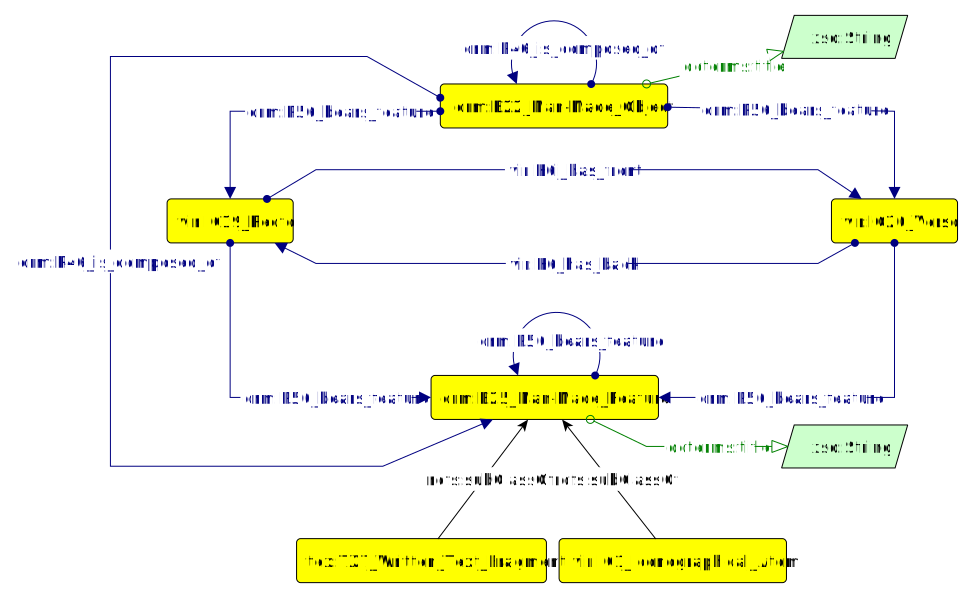
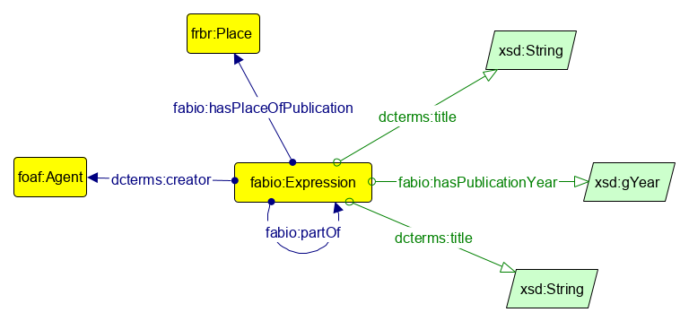
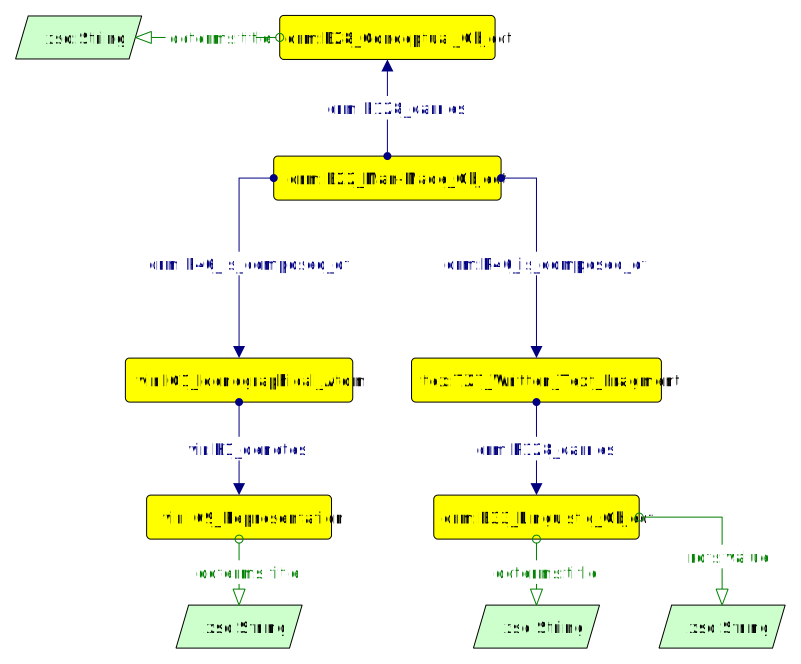
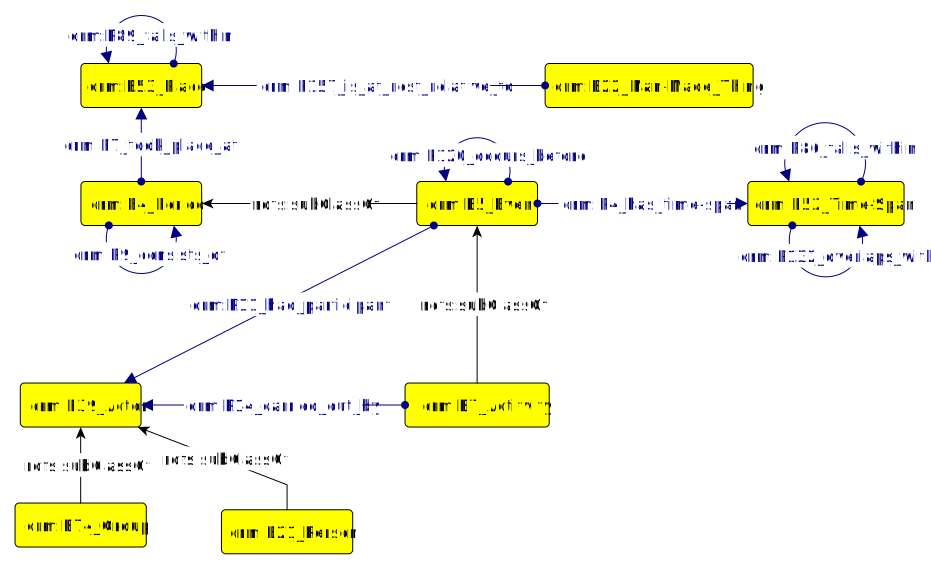
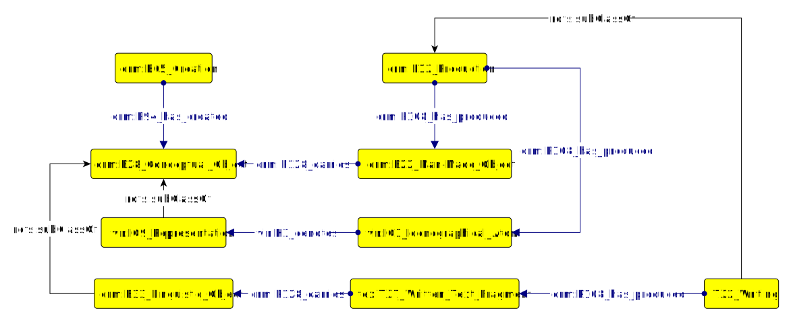
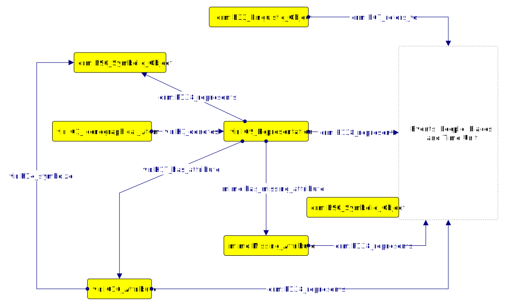
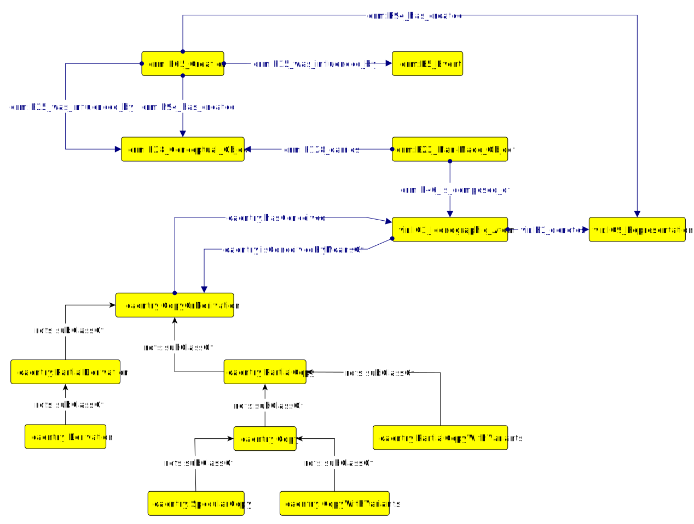

# MIMA
Multi-disciplinary Interpretations model on Manuscript Apparatus


## The Model
Here below is the list of prefixes of reused ontologies in MIMA model.

`crm: <http://www.cidoc-crm.org/cidoc-crm/>`
`vir: <http://w3id.org/vir#>`
`fabio: <http://purl.org/spar/fabio/>`
`dcterms: <http://purl.org/dc/terms/>`
`oaentry: <http://purl.org/emmedi/oaentry/>`
`cwrc: <http://sparql.cwrc.ca/ontologies/cwrc#>`
`cito: <http://purl.org/spar/cito/ >`
`hico: <http://purl.org/emmedi/hico/>`
`prov: <http://www.w3.org/ns/prov#>`
`np: <http://www.nanopub.org/nschema#>`
`mima: <https://raw.githubusercontent.com/ValentinaPasqual/mima/master/mima_ontology.ttl/>`

For what concerns CRMtex, at the moment no rdf has been provided in the documentation. So, we use the prefix tex in order to refer to the conceptual model entities expressed in the documentation . 

### Level 0: factual data
Factual data are those data whose certainty is somehow given for granted, since these address concepts and real objects that are not deemed questionable. These include: the physical description of artefacts (such as the logical organisation of a manuscript), bibliographic metadata (e.g. the edition of a cited work), and the explicit reference, citation, or mention of existing artefacts in the main text of a subject work.

### The manuscript structure 
The unit conceptual model represents the manuscript physical structure in its components which are considered not contestable. Such components may be subject of further interpretations, meaning that they are analysed and commented on by experts. Therefore, they become the carriers needed to connect textual or visual contents to interpretative acts. The unit model representing physical aspects of the manuscript is shown in figure 1. This unit considers manuscript textual content, visual content (e.g maps, illustrations) and physical features (e.g. recto and verso).
The model allows to link a fragment of text (i.e. class `tex:TX7_Written_Textual_Fragment`) or an illustration (i.e. class `vir:IC1_Iconographical_Atom`) with a specific manuscript page (represented as `crm:E22_Man-Made_Object` specifying its `vir:IC19_Recto` or `vir:IC20_Verso`) through the object property `crm:P46_is_composed_of`. Each recto or verso therefore contains some fragments which can be textual or visual (expressed through `vir:IC19_Recto` or `vir:IC20_Verso` `crm:P56_bears_feature` `tex:TX7_Written_Textual_Fragment` or `vir:IC1_Iconographical_Atom`). Alternatively, the the whole manuscript (represented by the class `crm:E22_Man-Made_Object`) can be linked directly to textual and visual fragments through the object property  `crm:P46_is_composed_of`, depending on the completeness of the information in the source material. 

In this way, the model also expresses the possibility that an illustration or text fragment can cover more than one page. For example the ptolemaic map of Italy appears in two pages, namely:12v-13r together with two cartouches.
Finally, the manuscript as well as whichever fragment can have a title (represented through the data property `dcterms:title`).



#### Editions
To model aspects related to editions of published works that are cited in the examined source materials, we reuse the `fabio` ontology, as shown in figure 2. What has emerged from data is that most of the mentioned editions regard books (which can be represented with subclasses of `fabio:Expression`. e.g. `fabio:Book` and `fabio:BookChapter` and `fabio:JournalArticle`) along with information about title, place  and of publication.  For the sake of simplicity, when we are not aware of the specific edition that the author had at hand, we decided to represent only the FRBR Expression of the cited work, while we avoid representing its possible manifestations.



#### Artefacts related to the manuscript
That manuscript fragments can be connected somehow to artefacts that are mentioned. Such relations may vary significantly according to the context and may be deemed questionable; hence this information is not part of level 0 but is described in the following section (first level). 
In particular, aspects related to visual works of art (e.g. paintings or miniatures or sculptures) are modelled by using `vir` ontology, which represents whichever visual artefact as an instance of `vir:IC1_Iconographic_Atom`. Other manuscripts (if sufficient information is provided in the source material) are represented as manuscript structure. Buildings are described as instances of `crm:E22_Man-Made_Object`. Statements about artefacts without sufficient information (e.g. measurements with fuzzy information), are represented by means of the `class crm:E28_Conceptual_Object`. Themes and symbols are represented with individuals of the class `crm:E90_Symbolic_Object`. 

### First Level: assertion
#### Connecting physical features to their conceptual meaning: manuscripts fragments and their interpretations
Manuscript physical features (represented as instances of the class `vir:IC1_Iconographical_Atom` for what concerns visual fragments and instances of the class `mima-tex:TX7_Written_Text_Fragment` for what concerns textual fragments) carry (respectively `vir:K1_denotes` and `crm:P128_carries`) their conceptual meaning (respectively `vir:IC9_Representation` and `crm:E33_Linguistic_Object`). Such conceptual meaning is the interpretation given by someone to a set of signs. This means that each conceptual meaning is assigned by an expert and therefore can be contestable. This link between physical and conceptual aspects of each manuscript fragment represents the interaction pivot between level 0 - factual data - and  level 1 - interpretations on factual data.
For what concerns the triple `crm:E22_Man-Made_Object` `crm:P128_carries` `crm:E28_Conceptual_Object`, it represents the conceptual meaning of the whole manuscript. For example “Historiae Ferrariae è ampiamente influenzata dalla Chronaca Parva Ferrarensis di Roccobaldo” , expresses that Chronaca Parva Ferrarensis  has no further information in the source material describing its physical carrier. 



#### People, Events, Time and Places: dealing with actions in and on the manuscript
Along with the manuscript (and its fragments), the model allows to represent other entities which can interact with it. Indeed, in the source material we found entities interacting with the manuscript during its life-cycle (such as people or artefacts influencing the creation of the manuscript, as explained in CS3) and entities described in the manuscript fragments (most of them narrating historical events, due to the annalistic nature of Historiae Ferrariae). 
Considering the heterogeneity of cases expressed, it has been decided to model them as general as possible without any distinction between entities narrated by the manuscript and entities concerning the history of the manuscript and its fragments, i.e. its production event. To address most of such scenarios, CIDOC-CRM ontology has been reused. 

Periods of time and events (represented respectively as instances of the classes `crm:E4_Period`
 and `crm:E5_Event`) which took place at a certain place (represented through object property `
crm:P7_took_place_at` and class `crm:E53_Place`) at a certain time (represented through object property `crm:P7_took_place_at`  and class `crm:E52_Time-span`). 
Moreover, this unit represents the description of an actor who performs an activity (represented through `crm:E7_Activity 	crm:P14_is_carried_out_by crm:E39_Actor`). This is particularly used in order to represent production and creation events of artefacts. The unit also represented the description of an actor who is involved in an event (represented by the `crm:E5_Event crm:P11_had_partercipant crm:E39_Actor` or `crm:E74_Group`). 
Then, the unit represents sequence of events (an event occurs after/before another), represented through `crm:E5_Event crm:P120_occurs_before crm:E5_Event`).  

Hierarchy of periods, events and places (a period/place occurs inside another). Places hierarchy is modelled through the use of the property `crm:P89_falls_within`. For what concerns periods and events consider the following scenario “[Con l’addizione Erculea duca Ercole I volle] la restaurazione delle molte chiese della città, volle dotare Ferrara di una nuova cinta muraria ”, where the period “Addizione Erculea” (instance of the class `crm:E4_Period`) comprehends the events of restauration of city churches (instance of the class `crm:E5_Event`) and production of new city walls (instance of the class `crm:E5_Event`) and where the period and its events are linked connected through the use of `crm:P9_consist_of`. Finally, `crm:E22_Man-Made_Object crm:P157_is_at_rest_relative_to crm:E53_Place` represents the place occupied by some immovable cultural property (i.e. to address the place where Hofbibliothek is located in Wien).



##### A particular focus on creation and production events
As expressed in the previous section, the link between level 0 (factual data) and level 1 (contestable assertions) is represented by the connection between each manuscript physical fragment and the conceptual object it conveys. This implies that we must consider that such duality (physical vs conceptual) of manuscript fragments is reflected also on their production or creation. 
Considering that the manuscripts may be produced by multiple hands, the model provides the possibility to express a production event (expressed through the class `crm:E12_Production`) for each of the fragments. 
For example the miniaturist (performing manuscript illustration creation and production - represented with the class `crm:E65_Creation` and `crm:E12_Production` of the illustration), while the manuscript author (represented with the class `crm:E65_Creation` of the whole manuscript), can be different from the actual producer (copyst) of the manuscript. 

For these reasons, a production event (represented with the class `crm:E12_Production`) can produce (represented with the property `crm:P108_has_produced`) or the manuscript (represented with the class `crm:E22_Man-Made_Object`) or an illustration (represented with the class `vir:IC1_Iconographical_Atom`) or a textual fragments (represented with the class `tex:TX7_Written_Text_Fragment`). For what concerns textual fragments the production event can be specialised in with class `mima-tex:TX2_Writing`. Respectively for what concerns conceptual aspects of the manuscript, the creation event (represented with the class `crm:E65_Creation`) creates (represented with the property `crm:P94_has_created`) the whole manuscript conceptual meaning (represented with the class `crm:E28_Conceptual_Object`), the illustration representation (represented with the class `vir:IC9_Representation`) and the textual content (represented with the class  `crm:E33_Linguistic_Object`).



Production and creation events are fundamental to catch disciplines interests. For example the `mima-tex:`TX2_Writing (which is a subclass of `crm:E12_Production`) is the main interest for palaeographical analysis. Philology and iconography are interested in both production and creation events in order to detect influences and sources of the manuscript and its fragments.

#### Hermeneutic analysis: The history narrated by the manuscript 
Content analysis means first of all to recognise an intellectual aspect expressed by the text or an image included in the manuscript visual and textual physical fragments (respectively `vir:IC1_Iconographic_Atom` and `mima-tex:TX7_Written_Text_Fragment`). The hermeneutic act assigns some meaning to the physical fragments (respectively represented as vir:IC9_Representation class and `crm:E33_Linguistic_Object class`).
In particular, vir allows to express iconographical items as representations and to further annotate portions of them (i.e. class `vir:IC10_Attribute`). 
Moreover, an instance of `vir:IC9_Representation` can carry a symbolic meaning (connecting `vir:IC9_Representation` class through the property `crm:P138_represents` to `crm:E90_Symbolic_Object`). 
When dealing with written text, the intellectual aspect of the textual physical fragment is identified with the class `crm:E33_Linguistic_Object`. 
The highlighted intellectual aspects (individuals of the classes `vir:IC9_Representation` or `vir:IC10_Attribute`) can refer to some real-world object, which has been already described [here](#people--events--time-and-places--dealing-with-actions-in-and-on-the-manuscript)). Such link is represented through the object property `crm:P138_represents`. Meanwhile for what concerns `crm:E33_Linguistic_Object` referring to some real-world objects, the link is represented through the object property `crm:P67_refers_to`. 



#### Historical sources and influences between works: The history on the manuscript

Influences can be expressed both on the whole manuscript and on single manuscript fragments (in particular on visual apparatus). The model unit represents the creation event (represented with `crm:E65_Creation class`) which produced (represented with `crm:P94_has_created`) the manuscript conceptual aspect and the illustration representation (respectively represented with `crm:E28_Conceptual_Object` and `vir:IC9_Representation classes`). Such activity has been influenced by (represented by `crm:P15_was_influenced_by` property) an event (i.e. historical event) or a conceptual object (respectively represented by `crm:E5_Event` and `crm:E28_Conceptual_Object`). Such conceptual objects can be for instance some literary production, other manuscripts, measurements.  
To vehiculate the fact that a manuscript illustration is a copy of some other illustration, the first is represenyted as an instance of both `vir:IC1_Iconographical_Atom` and `oaentry:CopyOrDerivation` (or one of it subclasses such as `aentry:Copy` and the others represented in the following image), since the illustration is both an artefact and a copy of something other artefact. `oaentry:CopyOrDerivation` is then connected to another visual artwork (i.e. illustration, painting, represented again with `vir:IC1_Iconographic_Atom class`) through the property `oaentry:isConceivedByMeansOf`to express that the first is a copy of the second. 


 
#### The physical text as object of interest
Another relevant aspect emerged when analysing the manuscript fragments are the interpretations made on the basis of the analysis of physical features of a portion of text (i.e. a palaeographic study of the source). The focus here is no more on the representation or intellectual meaning of a manuscript’s fragment (hermeneutic analysis), but on the graphical features of that textual section. Palaeographic analysis focuses on handwritten physical features of the text. 

As can be seen in figure 8, the palaeographic analysis focuses on the writing activity which produced the text fragment under analysis (represented as an instances of the  text:TX2_Writing tex:P108_has_produced tex:TX7_Written_Text_Fragment) employing a writing system e.g latin alphabet (represented with text:TX2_Writing tex:P1_used_writing_system tex:TX3_Writing_System). Since palaeographic interest is on determining characteristics and graphic typologies of handwriting witnesses in the manuscript, such expressive need in represented in the model as the activity of writing performed using a specific graphic typology or scriptorial style (represented as text:TX2_Writing crm:P16_used_specific_object crm:E28_Conceptual_Object. The graphic typology or scriptorial style are specified by their type and appellation ( crm:E28_Conceptual_Object crm:P1_is_identified_by crm:E41_Appellation and crm:E28_Conceptual_Object crm:P2_has_type crm:E55_Type). Such type can be defined by some specific characteristics (expressed through the object property crm:P150_defines_typical_parts_of). For example, the expert is analysing a textual fragment stating that: “La corsiva umanistica, denotata da una lieve inclinazione a destra, da ductus corsivo e frequenza legature dal basso ” (the complete excerpt can be seen in section 4.2.6 - CS6).	 
Moreover, a graphic typology or a scriptorial style can convey a symbolic meaning and is represented as crm:E28_Conceptual_Object crm:P67_refers_to	 crm:E90_Symbolic_Object. For example the use of “capitale epigrafica” is symbolising Historiae Ferrariae monumentality (the complete example can be seen in CS7 in section 4.2.7). 	
Finally, since Historiae Ferrariae text has been written in multiple languages (e.g. Latin, Vernacular Italian), the model represents it as an instance of the class crm:E56_Language connected to the conceptual meaning (represented as an instance of the class crm:E33_Linguistic_Object) of the text fragment under analysis (represented as an instance of the class	 tex:TX7_Written_Text_Fragment). 

 
Figure 8: Conceptual model unit representing text graphical characteristics.
### Second level: provenance
#### Scholars’ statements as interpretation acts
In the prior level we described “what a scholar interpreted from an object”, that is, the content of scholars’ assertions as derived from the analysis of the manuscript. In this section we address aspects and information about how such statements were formulated, meaning its provenance and all the pieces of information that allow us to estimate its degree of certainty. 
Analysing the source material some patterns emerged: 

1.	The interpretation act is a scholar’s interpretation based on some manuscript fragments. For instance when the expert performs an hermeneutic analysis on some manuscript visual fragment (such representation has been already presented in section 4.1.2.3).
2.	The interpretation act is an expert's interpretation based on a manuscript fragment, and it is motivated by some text or reference in the manuscript. For instance, consider the following excerpt referring to the map representing Ferrara during “Addizione Erculea” period: “lo stesso Pellegrino, in un passo del IV libro delle sue Historiae, parla della cosiddetta “Addizione erculea” . 
3.	The interpretation act is based on other sources of information that are referenced by means of the citation of such sources. For instance, consider the following example “La descrizione dell’addizione e i disegni, inoltre, sono stati utili a Folin per stabilire una datazione abbastanza precisa della mappa e del testo che l’accompagna in particolare [...]” (the complete excerpt can be seen in section 4.2.2 - CS2).

The conceptual model unit presented below (shown in fig. 9) aims to represent these schemas, reusing some already existing ontologies.
As shown in figure 9, each assertion (represented in the assertion graph) is generated by an interpretation (represented with (represented with “Assertion Graph” prov:wasGeneratedBy hico:InterpretationAct). Such interpretation has a type (it is linked to some individual of the class hico:InterpretationType through the property hico:hasInterpretationType) and follows a criterion (it is linked to some individual of the class  hico:InterpretationCriterion through the property  hico:hasInterpretationCriterion). 
For what concerns individuals belonging to hico:InterpretationCriterion class, they has been extracted by abstracting experts analysis patterns from excerpts analysis, while individuals belonging to hico:InterpretationType class represent the three disciplines. Moreover each interpretation is performed by someone (hico:InterpretationAct prov:wasAssociatedWith prov:Entity) and has a certain degree of certainty (hico:InterpretationAct cwrc:hasCertainty cwrc:Certainty individuals). 
Additionally, such interpretation is extracted from a source edition (represented by hico:InterpretationAct hico:isExtractedFrom fabio:Expression. 	  fabio:Expression contextual information is modelled in 4.1.1.2.
Additionally, if the interpretative act is performed on the basis of another expert interpretation the model represents it like the source edition fabio:Expression (the one who bears the interpretative act) cito:cites another edition (fabio:Expression). 
Consider the following scenario “The illustration I probably represents the object O”. The assertion (represented in the assertion graph following the model units of level 0 and level 1 (respectively sections 4.1.1 and 4.1.2) is generated by an interpretation, which is an iconographical hermeneutic analysis. Iconographical analysis is represented as an instance of the class hico:InterpretationType, while hermeneutic analysis is represented with the class hico:InterpretationCriterion. 
The interpretation has been extracted from the source material of the use case (hico:InterpretationAct  hico:isExtractedFrom fabio:Expression).	 
In the scenario “probably” expresses lack of certainty, therefore the interpretation has a low degree of certainty (represented by “lowCertainty” individual belonging to crcw:Certainty connected to hico:InterpretationAct through the property cwrc:hasCertainty).  

 
Figure 9: Provenance and interpretative act of an assertion.

### Fourth level: publication information
Publication information aims to represent information related to who extracted information described in the previous levels as RDF statements and publishes the data. To represent such information we reuse properties of the prov ontology, i.e. the data property prov:wasAttributedTo to address the responsible entity (such a person or a software agent) and the data property prov:generatedAtTime to represent the publication time. 
 
Figure 10: Model unit representing publication information of each nanopublication.

### How levels are connected
To formally represent data addressed in the aforementioned four levels, we adopt named graphs so as to facilitate provenance annotations. In particular, graphs are linked with each other by means of another model, i.e. the Nanopublications model. 
In detail, named graphs respectively include level 1 (the assertion graph), level 2 (provenance graph) and level 3 (publication info graph). Level 0, the one describing factual data, is represented in another dedicated graph.
The connection between the graphs occurs through the specification of an additional graph, called head, that can be represented, in TriG (turtle ) syntax, as follows. 

``` 
    :head {
    ex:pub1 a np:Nanopublication .
    ex:pub1 np:hasAssertion :assertion-graph .
    ex:pub1 np:hasProvenance :provenance-graph .
    ex:pub1 np:hasPublicationInfo :pubInfo-graph .
}
```


